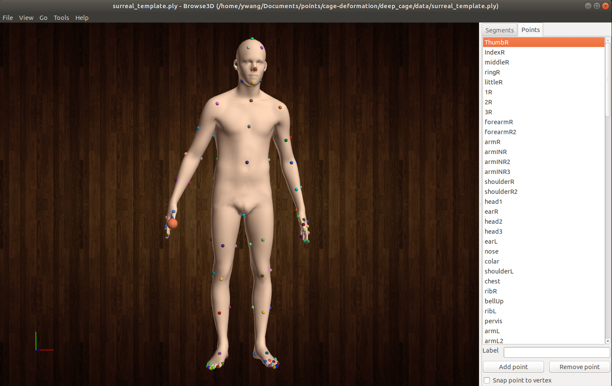

# Neural Cages for Detail-Preserving 3D Deformations
[[project page][project-page]][[pdf][pdf]][[supplemental][supp-pdf]]
## Installation
```bash
git clone --recursive https://github.com/yifita/deep_cage.git
# install dependency
cd pytorch_points
conda env create --name pytorch-all --file environment.yml
python setup.py develop
# install pymesh2
# if this step fails, try to install pymesh from source as instructed here
# https://pymesh.readthedocs.io/en/latest/installation.html
# make sure that the cmake 3.15+ is used
pip install pymesh/pymesh2-0.2.1-cp37-cp37m-linux_x86_64.whl
# install other dependecies
pip install -r requirements.txt
```
## Trained model
Download trained models from https://igl.ethz.ch/projects/neural-cage/trained_models.zip.

Unzip under `trained_models`. You should get several subfolders under `trained_models`, e.g. `trained_models/chair_ablation_full` etc.

### Optional
install Thea https://github.com/sidch/Thea to batch render outputs

## Demo
- deform source shape to target shape
<p class="callout warning">:exclamation: To test your with your own chair models, please make sure that your data is axis-aligned in the same way as our provided examples. </p>

```bash
# results will be saved in trained_models/chair_ablation_full/test
python cage_deformer_3d.py --dataset SHAPENET --full_net --bottleneck_size 256 --n_fold 2 --ckpt trained_models/chair_ablation_full/net_final.pth --target_model data/shapenet_target/**/*.obj  --source_model data/elaborated_chairs/throne_no_base.obj data/elaborated_chairs/Chaise_longue_noir_House_Doctor.ply --subdir fancy_chairs --phase test --is_poly
```
Example: input - target - output


- deformation transfer
```bash
# download surreal data from 3DCoded
cd data && mkdir Surreal && cd Surreal
wget https://raw.githubusercontent.com/ThibaultGROUEIX/3D-CODED/master/data/download_dataset.sh
chmod a+'x' download_dataset.sh
./download_dataset.sh

# baseline deform the original training source
python deformer_3d.py --dataset SURREAL --nepochs 2 --data_dir data/Surreal --batch_size 1 --num_point 6890 --bottleneck_size 1024 --template data/cage_tpose.ply --source_model data/surreal_template_tpose.ply  --ckpt trained_models/tpose_atlas_b1024/net_final.pth --phase test

# deformation transfer to a skeleton
python optimize_cage.py --dataset SURREAL --nepochs 3000 --data_dir data/Surreal --num_point 6890 --bottleneck_size 1024 --clap_weight 0.05 --template data/cage_tpose.ply --model data/fancy_humanoid/Skeleton/skeleton_tpose.obj --subdir skeleton --source_model data/surreal_template_tpose.ply --ckpt trained_model/tpose_atlas_b1024/net_final.pth --lr 0.005 --is_poly

# deformation transfer to a robot (with another model, which is trained using resting pose instead of the tpose)
python optimize_cage.py --ckpt trained_models/rpose_mlp/net_final.pth --nepochs 8000 --mlp --num_point 6890 --phase test --dataset SURREAL --data_dir data/Surreal --model data/fancy_humanoid/robot.obj --subdir robot --source_model data/surreal_template.ply --clap_weight 0.1 --lr 0.0005 --template data/surreal_template_v77.ply
```

## Training
### ShapeNet deformations
A binary file storing preprocessed training data is provided `data/train_Chair_-1_2500.pkl`. This consists of the chair models from the  PartSegv0 subset of ShapeNetCore.v1 dataset.
The following command is what we ran to create our results in the paper.
```python
python cage_deformer.py --data_cat Chair --dataset SHAPENET --data_dir {ROOT_POINT_DIR} \
  --batch_size 8 --nepochs 12 --num_point 1024 --bottleneck_size 256 --n_fold 2 --loss CD \
  --name shapenet_chairs --mvc_weight 0.1 --sym_weight 0.5 --p2f_weight 0.1 --snormal_weight 0.1 --full_net
```
#### Data generation
You can also create your own data from shapenet.

1. Download data from [ShapeNet.org](https://www.shapenet.org/). Make sure that a `synsetoffset2category.txt` file is located in the root directory. If it doesn't, you can copy `data/processed_shapenetseg/synsetoffset2category.txt` to the root directory.
2. Sample points from ShapeNet using the `scripts/resample_shapenet.py`
  ```python
  python resample_shapenet.py {INPUT_DIR} {OUTPUT_DIR}
  # example
  python resample_shapenet.py /home/mnt/points/data/ShapeNet/ShapeNetCore.v2/04530566 /home/mnt/points/data/ShapeNet/ShapeNetCore.v2.5000p/
  ```
**Alternatively**, you can use the presampled point data provided by Thibault (https://github.com/ThibaultGROUEIX/AtlasNet/blob/master/dataset/download_shapenet_pointclouds.sh).

### Humanoid deformations

Train a deformation only model with a fixed source shape and cage.
The comman below will use the rest pose source shape and the a handcreated source cage
One can also use `--template data/surreal_template_v77.ply`, which is a cage created by edge collapsing.
```
python deformer_3d.py --dataset SURREAL --nepochs 3 --data_dir data/Surreal --batch_size 4 --warmup_epoch 0.5 \
--num_point 2048 --bottleneck_size 512 --template data/cage_rpose.obj --source_model data/surreal_template.ply \
--mvc_weight 1.0 --loss MSE --mlp --name surreal_rpose
```

For deformation transfer, we use [Thea](https://github.com/sidch/Thea) to mark correspondences. An example of the landmarks is shown below.
This creates a landmark file such as `data/surreal_template.picked`, which will be used by `optimize_cage.py` to adapt the source cage to a novel target shape.


[project-page]: https://yifita.github.io/publication/deep_cage/
[pdf]: https://igl.ethz.ch/projects/neural-cage/06035.pdf
[arxiv-pdf]: https://arxiv.org/pdf/1912.06395.pdf
[supp-pdf]: https://igl.ethz.ch/projects/neural-cage/06035-supp.pdf

## cite
```
@inproceedings{Yifan:NeuralCage:2020,
  author={Wang Yifan and Noam Aigerman and Vladimir G. Kim and Siddhartha Chaudhuri and Olga Sorkine-Hornung},
  title={Neural Cages for Detail-Preserving 3D Deformations},
  booktitle = {CVPR},
  year = {2020},
}
```

